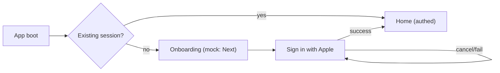

# FEAT-001: User Authentication

| Field | Value |
|-------|-------|
| **ID** | FEAT-001 |
| **Priority** | P0 |
| **Status** | `done` |
| **Revenue impact** | blocker |
| **Effort** | L |
| **Owner** | — |
| **Depth** | Full product spec (build-ready) |

> This is the **first domino**. FEAT-002 (trips), FEAT-003 (invites), FEAT-004 (remove hardcoded IDs), FEAT-015 (profile sync), FEAT-020 (billing), and FEAT-025 (analytics cohorts) all depend on a real, stable user identity. Build this first.

---

## 1. Problem & context

Today Xplore has **no concept of a real user**. Identity is a compile-time constant:

```dart
// lib/constants/constants.dart
const userId = '7d125e54-9de9-4a5c-bb15-29efacda4f9a';
```

```dart
// lib/features/profile/bloc/profile_cubit.dart
ProfileCubit() : super(const ProfileState(id: userId, name: 'Julian Rechsteiner')) { ... }
```

Consequences:

- Every device that installs the app **is the same person** on the map and in the gallery — locations all write to `locations/ph4kd/<same uid>`, photos all land in one bucket.
- There is **no account to bill**, no way to scope data per person, and no security boundary (Firebase paths are effectively public).
- Group travel is impossible: you cannot have "me" and "my friends" without distinct identities.

This blocks launch and every revenue path. It must ship before any multi-user behavior is trustworthy.

## 2. Goals & non-goals

### Goals

- Every session is backed by a **stable Firebase Auth UID**.
- Sign-in friction is minimal on iOS (one-tap **Sign in with Apple**).
- The UID flows through the app via a single `AuthCubit`, replacing the `userId` constant (handoff to FEAT-004).
- A user profile document exists in the backend (**Firestore `users/{uid}`**), ready for trips/billing.
- Firebase Security Rules move from "open" to "authenticated + authorized".

### Non-goals (explicitly out of scope here)

- **Anonymous auth / invitee deep-link-before-sign-in** → deferred. We use a hard gate for now (see §3); anonymous-first can be reintroduced when the invite loop (FEAT-003) is built.
- **Google Sign-In** → deferred (FEAT-030). Build provider-agnostic so adding it later is cheap.
- **Android sign-in providers** → FEAT-030.
- Trip creation / membership logic → FEAT-002.
- Invite/deep-link join → FEAT-003.
- Multi-provider account *linking* UI (e.g. merge Apple + Google) → later.
- Email/password forms — we deliberately avoid passwords (see §4).

## 3. Key product decision: when do we ask users to sign in?

**Decision: hard gate at the end of onboarding.** A first-time user goes through an onboarding flow and is asked to **Sign in with Apple** on the final step. Nothing past onboarding works until authenticated.

Rationale:
- **Simplicity first.** Apple-only + hard gate is the smallest possible surface that gives every session a real, stable UID. No anonymous accounts, no `linkWithCredential`, no in-place upgrade, no "logged out" vs "anonymous" branching.
- It unblocks the dependent features (FEAT-002/003/004/015/020/025) that just need a trustworthy `auth.uid`.
- The lowest-friction growth loop (invite links, FEAT-003) and the anonymous-first flow it wants are **deferred**; when we build them we can relax this gate to "anonymous-first, upgrade at value moment" without rewriting the identity plumbing (it will already read from `AuthCubit`).

**Onboarding (mocked now):** onboarding is not yet designed (FEAT-005). To preserve the structure, we ship a **placeholder onboarding screen with a single "Next" button** that advances to the sign-in step. This keeps the routing/flow shape correct so the real onboarding content can drop in later without touching the auth gate.



## 4. Auth providers

| Provider | Status | Why |
|----------|--------|-----|
| **Sign in with Apple** | Required (P0) | App Store policy mandates it when offering third-party sign-in on iOS; it's the lowest-friction option for our iOS-first audience. The only provider for this feature. |
| Google Sign-In | Deferred (FEAT-030) | Common for the 25–40 traveler segment; cheap to add later via Firebase. Out of scope now to keep this simple. |
| Anonymous | Deferred | Underpins a future anonymous-first / invite-before-sign-in flow (§3). Not used now. |
| Email magic link | Deferred | Useful for Android/web later (FEAT-030); avoid password UIs entirely. |
| Phone | Deferred | SMS cost + friction; revisit if Apple insufficient. |

**No passwords.** We never build a password field — it's a security liability and friction we don't need.

## 5. User flows

### 5.1 First launch (new user)

1. App boots → `AuthCubit` resolves to **unauthenticated** (no stored session).
2. **Onboarding** (mock: a screen with a "Next" button; FEAT-005 fills in real content).
3. Final onboarding step is **Sign in with Apple**.
4. On success: a `users/{uid}` profile doc is created/updated; route to Home.
5. On cancel/failure: stay on the sign-in step; non-blocking error; user can retry.

### 5.2 Returning user

1. App boots → Firebase restores the existing session automatically. No re-auth, onboarding skipped → straight to Home.
2. Profile/name/avatar hydrate from `users/{uid}` (fuller sync in FEAT-015).

### 5.3 Sign out

- Available from Profile. Sign-out clears the session and returns to the sign-in step (or onboarding start).

### 5.4 Invitee via deep link

- **Deferred to FEAT-003.** With the hard gate, an invitee signs in with Apple first, then lands in the trip. The frictionless "see the trip before signing in" experience requires anonymous-first and is explicitly out of scope here (§3).

### 5.5 Edge cases & handling

| Case | Handling |
|------|----------|
| Apple sign-in cancelled mid-flow | Stay on sign-in step; non-blocking toast; user can retry. |
| Network failure during sign-in | Inline error + retry; never leave a half-state. |
| Apple "Hide My Email" | Store the relayed email as-is; never assume a real address. |
| Apple returns name only on first authorization | Capture display name on that first call and persist immediately to `users/{uid}` (Apple won't send it again). |
| Token expiry / revoked | Firebase refreshes silently; if refresh fails, drop to unauthenticated and route back to the sign-in step. |
| App reinstall | Session is lost (expected). User signs in with Apple again and recovers profile from `users/{uid}`. |

## 6. Data model

New backend user document in **Cloud Firestore**, keyed by `auth.uid`. (Realtime Database is reserved for live location sharing only; everything else — users, and later trips/billing — uses Firestore.)

```jsonc
// Firestore: users/{uid}
{
  "uid": "string",                 // == auth.uid
  "displayName": "string",         // from Apple, editable (FEAT-015)
  "email": "string|null",          // may be Apple private relay or null
  "photoUrl": "string|null",       // cloud avatar (FEAT-015)
  "providers": ["apple"],          // linked providers, for account UI later
  "createdAt": "timestamp",
  "lastSeenAt": "timestamp"
}
```

### App-side state

A new `AuthCubit` exposes auth state to the whole tree. Suggested shape (Freezed, matching existing patterns):

```dart
// lib/features/auth/bloc/auth_state.dart (sketch)
@freezed
sealed class AuthState with _$AuthState {
  const factory AuthState.unknown() = AuthUnknown;              // boot, before first resolve
  const factory AuthState.unauthenticated() = AuthUnauthenticated;
  const factory AuthState.authenticated({
    required String uid,
    required String displayName,
    String? email,
    String? photoUrl,
  }) = AuthAuthenticated;
}
```

`ProfileCubit` and `ProfileState.id` should consume `AuthCubit`'s uid rather than the constant.

## 7. Firebase Security Rules (must ship with this feature)

Today rules are effectively open. With auth we tighten:

- **Firestore `users/{uid}`**: read/write only where `request.auth.uid == uid`. (`firestore.rules`)
- **RTDB `locations/{tripId}/{uid}`**: a user may write only their own `{uid}` node. Membership scoping arrives with FEAT-002; until then require `auth != null` and `uid == auth.uid` on write.
- **Storage `gallery/{tripId}/...`**: `request.auth != null`; tighten to trip membership in FEAT-014.

Deliverable: committed `firestore.rules` and RTDB rules JSON requiring `auth != null`, even if full membership checks are stubbed until FEAT-002. **Do not ship auth without closing the open-rules hole.**

## 8. Analytics (events to emit — formalized in FEAT-025)

| Event | When |
|-------|------|
| `auth_sign_in_started` | User taps "Sign in with Apple" |
| `auth_sign_in_succeeded` | Apple sign-in success (include provider) |
| `auth_sign_in_failed` | Failure (include reason bucket) |
| `auth_sign_out` | User signs out |

These feed the onboarding/invite funnels in VISION.md.

## 9. Acceptance criteria

- [ ] First launch shows a (mock) onboarding screen with a "Next" button that advances to a Sign-in-with-Apple step.
- [ ] Sign in with Apple works on a physical iOS device and produces a Firebase session with a non-null UID.
- [ ] Returning users with a valid session skip onboarding/sign-in and land on Home.
- [ ] `AuthCubit` is provided at the app root (`MultiBlocProvider` in `main.dart`) and exposes uid + auth state stream; the app gates on `AuthState`.
- [ ] `ProfileCubit`/`ProfileState.id` reads UID from `AuthCubit`, not the `userId` constant (constant quarantined — full removal in FEAT-004).
- [ ] A Firestore `users/{uid}` document is created/updated on first authenticated session.
- [ ] Sign out clears the session and routes back to the sign-in step (no dead-end logged-out screen).
- [ ] Firebase Security Rules require `auth != null` for all user/location/gallery writes; `firestore.rules` + RTDB rules committed.
- [ ] Apple edge cases handled: name captured on first authorization; Hide-My-Email tolerated; cancellation non-blocking.
- [ ] Analytics events from §8 fire (can be stubbed behind FEAT-025's wrapper).
- [ ] `flutter analyze` clean; new `AuthCubit` has unit tests with a mocked `FirebaseAuth`.

## 10. Success metrics

- 100% of post-onboarding production sessions have a non-null Firebase UID.
- Onboarding → sign-in completion > 80%.
- < 1% of sessions stuck in `AuthState.unknown` beyond 3s after boot.
- Zero cross-user data writes in QA (each device writes only its own location/gallery nodes).

## 11. Implementation plan (suggested, mapped to the codebase)

New feature module following the existing feature-first pattern:

```
lib/features/auth/
├── bloc/
│   ├── auth_cubit.dart        # wraps FirebaseAuth; resolve session, Apple sign-in, sign out
│   └── auth_state.dart        # Freezed states (§6)
├── data/
│   └── auth_repository.dart   # Firebase Auth (Apple) + Firestore users/{uid} doc writes
└── presentation/
    ├── onboarding_page.dart   # mock onboarding ("Next") — placeholder for FEAT-005
    └── sign_in_page.dart      # "Sign in with Apple" step
```

Step-by-step:

1. **Deps**: add `firebase_auth`, `cloud_firestore`, `sign_in_with_apple` to `pubspec.yaml`; run `make get` + `make gen`.
2. **Bootstrap**: in `main.dart`, after `initFirebase`, add `BlocProvider<AuthCubit>(lazy: false)` to the root `MultiBlocProvider`; `AuthCubit` listens to `FirebaseAuth.authStateChanges()` and emits `unknown → unauthenticated | authenticated`.
3. **AuthGate**: wrap `MaterialApp`'s home/routing so `AuthState` decides between onboarding/sign-in vs the app shell (Home). Returning sessions skip straight to Home.
4. **AuthCubit**: methods `signInWithApple()`, `signOut()`; on success, upsert `users/{uid}` via `AuthRepository`, capturing Apple display name on first authorization.
5. **Profile handoff**: change `ProfileCubit` to read uid from `AuthCubit` (constructor injection or `context.read`), drop the hardcoded name default (hydrate from `users/{uid}` per FEAT-015 later).
6. **Constant quarantine**: leave `userId` in place only behind a debug/demo flag; production reads `AuthCubit.uid`. Full removal is FEAT-004.
7. **Rules**: write & commit `firestore.rules` (users/{uid} owner-only) and RTDB rules requiring `auth != null`; deploy to dev project.
8. **iOS config**: enable Sign in with Apple capability in Xcode (`Runner` target → `Runner.entitlements`); ensure Apple provider enabled in Firebase console.
9. **Onboarding + sign-in UI**: build with existing dark theme primitives (`XploreColors`, Poppins, glass components). Onboarding is a single "Next" placeholder.
10. **Analytics**: emit §8 events (wrapper stub until FEAT-025).
11. **Tests**: unit-test `AuthCubit` with a fake `FirebaseAuth`; widget-test the sign-in page states.

### Related code touchpoints

- `lib/main.dart` — bootstrap + provider registration + auth gate
- `lib/routes.dart` — `Paths.onboarding` currently returns an empty `Container()`; wire onboarding + sign-in entry points
- `lib/constants/constants.dart` — `userId` constant (quarantine → removal in FEAT-004)
- `lib/features/profile/bloc/profile_cubit.dart`, `profile_state.dart` — consume real uid
- `lib/features/location/bloc/location_cubit.dart` — `// TODO: use real user id from auth` (this resolves it)
- `lib/features/map/bloc/map_cubit.dart` — marker icons keyed by `userId`
- `lib/features/gallery/bloc/gallery_cubit.dart` — uploads should attribute to uid

## 12. Risks

| Risk | Mitigation |
|------|------------|
| Hard gate increases drop-off vs anonymous-first | Accepted tradeoff for MVP simplicity; revisit with FEAT-003 invite loop. |
| Apple review rejection (Apple sign-in rules) | Apple is the only provider, so prominence is not an issue; test on device pre-submit. |
| Apple name only sent once | Capture + persist display name on the first authorization callback. |
| Shipping auth without rules → data exposure | Rules are a hard acceptance-criterion blocker (§7, §9). |

## 13. Open questions (with recommendations)

- **When do we relax the hard gate to anonymous-first?** → Recommend revisiting alongside FEAT-003 (invite deep links), since that's where the friction hurts most.
- **Do we ever fully remove the `userId` constant here or in FEAT-004?** → Quarantine here, remove in FEAT-004 to keep this PR focused.

## 14. Notes / history

- 2025-06-22: Created from codebase audit.
- 2026-06-22: Expanded into full build-ready product spec; status → `ready_for_dev`.
- 2026-06-22: Scope narrowed for MVP simplicity — **Apple-only**, **hard gate at end of (mocked) onboarding**, anonymous-first and Google deferred. `users/{uid}` moved to **Firestore**; RTDB reserved for location sharing only.
- 2026-06-24: **Shipped** via PR #73 — Google Sign-In as interim provider, `AuthCubit` + hard gate + mock onboarding + Firestore `users/{uid}`. Sign in with Apple deferred (see `.cursor/plans/apple_auth_hard_gate_*.plan.md`). Moved to `requests/done/`.
